# **Traffic Sign Recognition**

## Writeup

---

**Build a Traffic Sign Recognition Project**

The goals / steps of this project are the following:
* Load, explore, summarize and visualize the data set
* Design, train and test a model architecture
* Use the model to make predictions on new images
* Analyze the softmax probabilities of the new images
* Summarize the results with a written report


## Rubric Points
### Here I will consider the [rubric points](https://review.udacity.com/#!/rubrics/481/view) individually and describe how I addressed each point in my implementation.  

---
### Writeup / README

### Data Set Summary & Exploration

#### 1. Summary
I used the numpy library to calculate summary statistics of the traffic
signs data set:

* The size of **training** set is `34799`
* The size of the **validation** set is `4410`
* The size of **test** set is `12630`
* The shape of a traffic sign image is `(32, 32, 3)`, meaning `32 pixels x 32 pixels x 3 color channels (RGB)`
* The number of unique classes/labels in the data set is `43`

#### 2. Exploratory visualization

Here is an exploratory visualization of the data set. It is a histogram showing how the data is distributed across the 43 types of traffic signs:

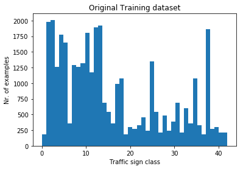

Some examples from the dataset are shown below:

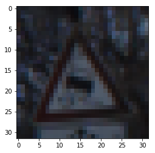
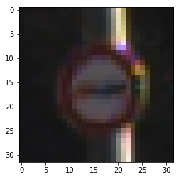
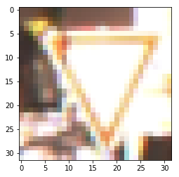
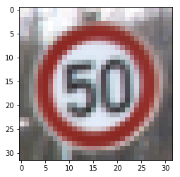
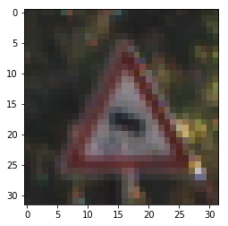
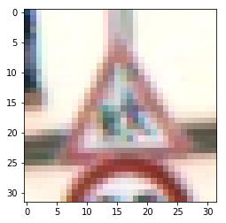
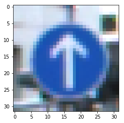


### Design and Test a Model Architecture

#### 1. Augmenting and preparing the dataset

I decided to augment the initial dataset by adding transformed images to it. I expected that this would enhance the accuracy of the results in multiple ways: just adding more data to learn from where there were too few examples seemed to be a valid argument, plus the modified images would make the CNN learn more generally and it would lower the risk over overfitting. I hoped that with translating the images, the CNN would learn more general patterns about traffic signs.

The process of transforming images included:
- **translation**: randomly translate an image by a few pixels, so it is shifted from its original center. Two examples are shown a few cells below.
- **blurring**, and
- **Gaussian blurring**

I extended the dataset in a way that all classes have at least 1000 examples.
This way, my training dataset was made of `67529` images.

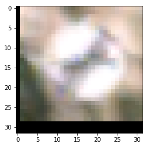
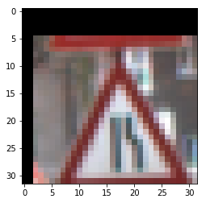

I transformed all images to grayscale, normalized them, then shuffled them.

A grayscaled and normalized example is shown below.

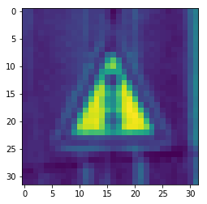


#### 2. Final model architecture

I started with the original LeNet architecture to see how well it performs. It did not disappoint: after some tweaking (playing around with batch size, learning rate and number of epochs), it plateaued around .965 accuracy on the validation set.

My final model consisted of the following layers:


|  Layer  					| Input | Output |
|:---------------------:|:----------------------:|:-----------------------:|
| Convolutional      		| 32x32x1  									| 28x28x6 |
| Activation layer, RELU function    			| 										| |
| Max pooling layer			| 28x28x6											| 14x14x6 |
| Convolutional  		| 		14x14x6			|  10x10x16 |
| Activation layer, RELU function    			| 										| |
| Max pooling layer			| 10x10x16									| 5x5x16 |
| Flatten layer |  5x5x16 | 400 |
| Fully Connected layer | 400 | 120 |
| Activation layer, RELU function    			| 										| |
| Fully Connected layer | 120 | 84 |
| Activation layer, RELU function    			| 										| |
| Fully connected layer | 84 | 43 for the 43 labels |


#### 3. Training the model

To train the model,

- AdamOptimizer was used,
- a learning rate of 0.0009 turned out to a be a good value, and
- I used 40 epochs, with
- a batch size of 100.

I experimented a lot with the learning rate above all. First, it was tempting to use a much higher learning rate, because it started off better, but it peaked early, around 85-90% accuracy, so I slowly reduced it until I reached a good compromise in the accuracy vs time.

#### 4. My approach at finding a solution


I started off with the well-known LeNet architecture. Of course I had to change some values (dimensions of inputs and outputs), but it was a very good start. I experimented with adding one, then two dropout layers with different probabilities. This seemed to worsen the results somehow, at least in the early stages. It was at this point actually the I had the idea to augment the dataset at all. A significant amount of time was spent extending the original dataset, so I did not experiment with further layers: LeNet stood the challenge very well.

I think that in the end, one or two dropout layers could have been introduced to the augmented dataset, but at that point I ran out of GPU capacity (and money to fund it).
Further augmentation of the dataset could yield even higher results. Only very basic transformations were used, so there are several others to introduce to this pipeline (tilting, skewing, rotating, cropping, zooming, erasing, etc).

My final model results were:

* training set accuracy of `96.5%`
* validation set accuracy of `99.5%`
* test set accuracy of `89.9%`

### Test a Model on New Images

#### 1. Custom traffic sign images found on the web

Here are nine German traffic signs that I found on the web:


 

#### 2. The models prediction on the new traffic signs

Here are the results of the prediction:

| Image			        |     Prediction	        					|
|:---------------------:|:---------------------------------------------:|
| Keep right      		| Keep right  									|
| Stop    			| Stop										|
| Yield			| Yield											|
| General caution  		| 	Bumpy road		 				|
| Speed limit 50		| Speed limit 50  							|
| Road works		| Road works     							|
| No entry	| No entry    							|
| Slippery Road	| Keep right  							|
| Speed limit 30		| Speed limit 30    							|


7 out of the 9 images were classified correctly, thus the performance on the downloaded images was 77.8%. The images were cut out in a similar fashion to the training images, with the traffic sign at around the center. One image, representing a 20% slope caution sign, was not part of the training dataset, so it was expected that it's not going to be recognized.

77.8% is worse than the performance on the test set, however, this set included an image that was not 'taught'.


#### 3. Softmax probabilities and predictions for the new images

1.  The CNN is certain that the image is a `keep right` sign (1.00000000e+00 probability) **CORRECT**
2.  The CNN is quite certain that the image is a stop sign (.998 probability).  **CORRECT**
    The second choice is the `no entry` sign, which is reasonable: the shape and patter is somewhat similar.
3. The CNN is certain that the image is a `yield` sign  (1.00000000e+00 probability) **CORRECT**
4. The CNN is certain that the image is a `bumpy road` sign  (1.00000000e+00 probability) **INCORRECT**
   The real image is a 20% slope sign, which was not taught to the CNN.
5. The CNN is certain that the image is a `Speed limit 50` sign (.99999 probability) **CORRECT**
6. The CNN is certain that the image is a `road works` sign (1.00000000e+00 probability) **CORRECT**
7. The CNN is certain that the image is a `no entry` sign (1.00000000e+00 probability) **CORRECT**
8. The CNN is the least certain about this image: it gives .95302 probability that its a `keep right sign`, despite the fact that it's a `slippery road` sign. The fact that the image has a different sign with its back facing the camera might be a big factor in this error.  **INCORRECT**
9. The CNN is certain that the image is a `Speed limit 30` sign (.99999 probability) **CORRECT**

The code output with the softmax probabilites and labes can be seen below:

```
TopKV2(values=array([
       [  1.00000000e+00,   1.85656843e-20,   1.78306907e-20,
          6.09276783e-22,   3.70710170e-28],
       [  9.98943150e-01,   1.05686102e-03,   3.04377702e-19,
          7.86749979e-21,   6.19810380e-25],
       [  1.00000000e+00,   1.10654023e-15,   2.84433432e-17,
          1.73675028e-18,   1.46082309e-18],
       [  1.00000000e+00,   3.76812600e-12,   3.13648915e-16,
          9.01054465e-21,   3.96238860e-21],
       [  9.99999762e-01,   2.72983726e-07,   3.86203500e-11,
          2.55116952e-11,   5.09163024e-14],
       [  1.00000000e+00,   5.03614661e-09,   2.05094644e-12,
          7.86462692e-13,   6.76174712e-23],
       [  1.00000000e+00,   1.84148534e-23,   1.21047069e-23,
          1.84101016e-28,   5.78062795e-31],
       [  9.53025341e-01,   2.78714485e-02,   1.63501427e-02,
          2.72562006e-03,   1.65077345e-05],
       [  9.99999523e-01,   4.49873966e-07,   3.45631390e-09,
          5.39160550e-10,   2.96219910e-10]], dtype=float32), indices=array([[38, 12,  2, 25, 10],
       [14, 17, 13, 34,  3],
       [13,  6, 32, 38, 12],
       [22, 29, 28, 25, 38],
       [ 2,  1,  5,  8, 40],
       [25, 22, 29, 38, 24],
       [17, 14,  9, 10, 16],
       [38, 11, 37, 30, 23],
       [ 1,  0, 40, 39, 35]], dtype=int32))
```

### Conclusion

We can conclude that the original LeNet architecture, with slight modifications, performed well on traffic sign recognition task.
